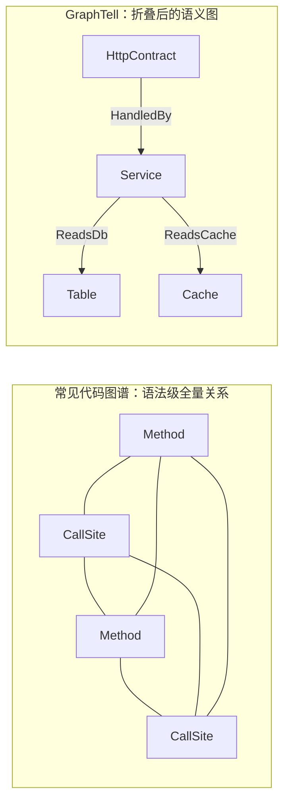

# GraphTell

> ⚠️ **Beta / 实验阶段**（当前 `0.1.0`）。功能与 FKB 格式仍可能变动，请勿用于生产关键决策。
> 已落地的语言 / 框架与已知边界见 [支持矩阵](graphtell/SUPPORTED.md)。

**把代码库变成一张「人能看懂」的图。** 以 `tree-sitter` 解析语法节点，再按**框架知识库（FKB）**合成语义节点，得到一张可查询、可标注的图；图之上再做规则校验与提示词增强。

---

## 为什么不是一团毛球

不少代码图谱工具（哪怕几十 K star）把**语法级全量关系**直接画出来：上万节点、几万条 `Calls` 边互相缠绕 —— 图很大，却**读不出语义**，只剩一团毛球。

GraphTell 走了三步来避免这件事：

1. **分层** —— 语法节点（`Method` / `CallSite` / `Class`）只是原料；图上另有**语义节点**：`HttpContract`、`Table`、`Cache`、`Queue`、`EventBus`、`Schedule`、`ConfigKey`…
2. **折叠** —— 默认视图**只显示语义节点与语义边**，语法调用链被折进 `via` 链，点开才看逐跳证据（不是丢掉，是换位置呈现）。
3. **语义边** —— 告诉你的不是"谁调用了谁"，而是"**读了哪张表 / 写了哪个缓存 / 读了哪个配置 / 投递了哪个队列**"。



**实测对照**（CRMEB v6.0.0）：全量 **96,241 个节点 / 125,368 条边**，但围绕**一条路由**的对象视图只有 **35 条边**，且每条都有明确语义 ——
`ReadsConfig` 28、`ReadsCache` 2、`ReadsDb` 1、`PassesThrough` 3、`ForeignKey` 1。

这就是「图很大」和「图能读」的区别。

---

## 三件事

| | 输入 | 输出 |
| --- | --- | --- |
| **① 语义图** | 一个代码库 | 语义节点 + 语义边（可查、可折叠、可看证据链） |
| **② 基于图的规则校验** | `rules/*.yaml` 里声明的规则 | 违规清单（`path:line` 可跳转） |
| **③ 基于图的提示词增强** | 一段（中文）提示词 | 该看哪些代码 + 可直接粘给 LLM 的上下文包 |

### ① 语义图：高效传递代码语义

图上的边是**语义**的，不是语法的：

```
HttpContract --HandledBy--> Method --ReadsDb--> Table
                                   --ReadsCache--> Cache
                                   --ReadsConfig--> ConfigKey
                                   --PublishesTo--> Queue
```

于是"这个接口动了什么"是一眼看出来的事，而不是人工沿调用链翻十几跳。默认折叠视图**严格只留语义节点与语义边**，语法节点收进 `via` 链。

### ② 基于图的规则校验

规则写在 YAML 里（不是硬编码），判据直接跑在图上 —— 例如"前端调用了后端不存在的接口"、"契约写了 handler 但没解析到方法"、"缓存只读不写"、"端点无人调用"。

```bash
./graphtell check --project 1 --json
```

产出带 `path:line` 的违规清单，可直接跳转。

### ③ 基于图的提示词增强（省 token）

`recall` 用中文问句检索，沿图把没出现关键词的相关代码一起带出来，输出**可直接粘给 LLM 的上下文包**（种子 + 相关代码 + `path:line` + 源码片段 + 图上关系）。

```bash
./graphtell recall --project 1 --query "优惠券相关代码" --markdown
```

**为什么省 token**：AI IDE 的常见做法是把"相关文件**整篇**"注入；GraphTell 只给 **top-N 命中 + 按需读取的那一扇窗口**（±12 行），行号精确指向要改的位置。
量化方式见 [`tools/token_savings_eval.py`](graphtell/tools/token_savings_eval.py)（可在你自己的工程上复现：对比"整文件注入"与"召回 + 按需读"的字符/token 比）。

---

## 🚀 在线 Demo（无需安装）

**<https://alvinliu87.github.io/graphtell/>**

多项目切换 + 三个页签：**图**（可缩放拖拽，按类型着色，点击看细节）、**规则检验**（可按严重度 / 规则筛选）、**提示词增强**（中文问句的召回上下文包）。

> 大工程在页面里只渲染一个**连通子图**并如实标注完整规模；第三方样本按各自许可证授权（源码不随仓库分发）。

---

## 快速开始

**方式 A：预编译包**（推荐试用） —— 见 [Releases](../../releases) 下载对应平台的包（含二进制与 `fkb/` `rules/` `views/` 运行时资产）。

**方式 B：Docker**

```bash
docker run -d -p 5177:5177 -v $(pwd)/data:/data ghcr.io/alvinliu87/graphtell:latest
# 或本地构建：docker build -t graphtell . && docker run -d -p 5177:5177 -v $(pwd)/data:/data graphtell
```

**方式 C：源码**

```bash
cd graphtell
cargo build
./target/debug/graphtell create --name 我的项目 --path /path/to/repo   # 建图
./target/debug/graphtell serve --port 5177                              # 启动服务
```

完整步骤（前端 / 桌面端 / 发布包 / 编码器 feature）见 [`graphtell/README.md`](graphtell/README.md#快速开始)。

---

## 仓库结构

> 代码在工作区子目录 `graphtell/` 下；本文件是索引，技术细节见 [`graphtell/README.md`](graphtell/README.md)。

| 路径 | 内容 |
| --- | --- |
| `graphtell/` | 源代码（Rust 后端 + React 前端 + Tauri 桌面端）、`fkb/`、`rules/`、`views/` |
| `graphtell/docs/demo/` | 示例 demo 静态站点（`tools/gen_demo.sh` 生成，GitHub Pages 托管） |
| `graphtell/tools/` | 分析与评测脚本 |
| `samples/` | 样本代码库 —— **不随仓库分发**（见 [样本许可证](graphtell/docs/samples-licenses.md)） |

## 技术栈（简述）

Rust（六边形架构 + SOLID，SQLite 持久化）· React + TypeScript + Ant Design（FSD）· Tauri 桌面常驻 · tree-sitter · FKB（YAML 驱动的框架知识）。

## 许可证

[MIT](LICENSE) © GraphTell contributors
