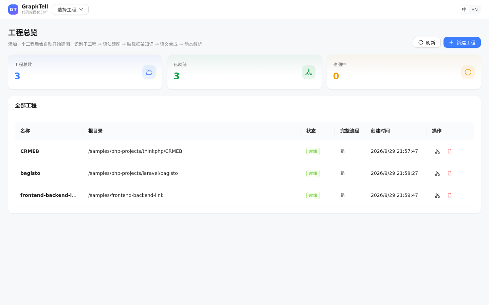
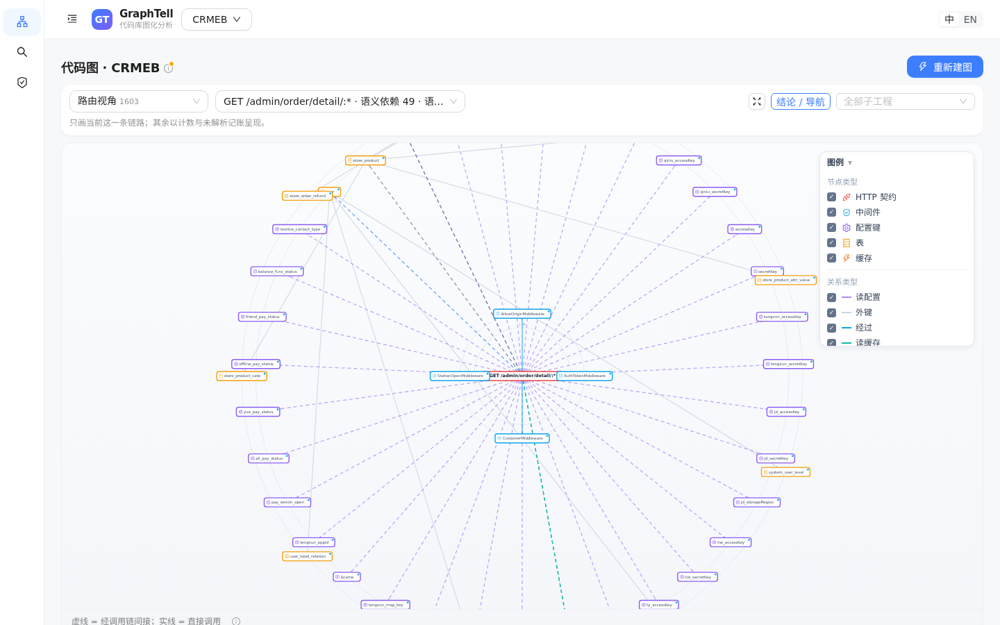
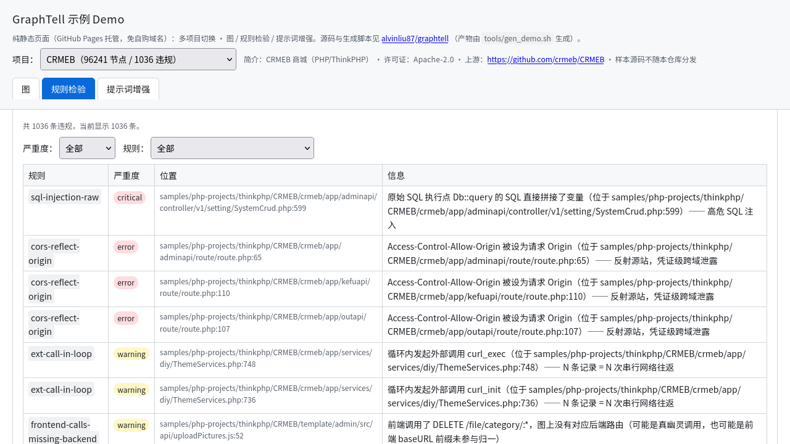
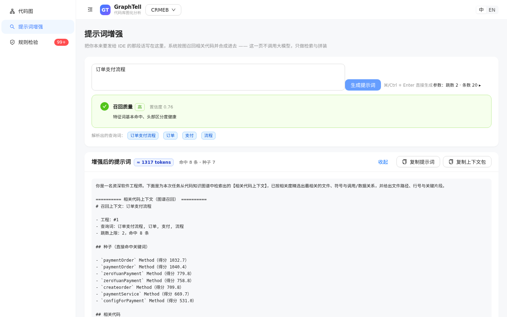

# GraphTell static demo

This is a purely static site (no backend dependency) generated with the **real product frontend +
recorded API replay**; it can be hosted on GitHub Pages or any static hosting.

## What you can do in this demo
- **Browse projects**: the home page lists the recorded sample projects (CRMEB / Bagisto /
  self-made fixture).
- **Semantic graph**: open a project's "graph" tab to see the semantic dependency graph by
  perspective (routes / tables / events …); click a node to expand its chain (object view).
- **Rule checking**: the `compliance` tab shows rule hits and diagnostics.
- **Prompt augmentation**: the `recall / prompt` tab runs code recall over the **preset Chinese
  queries** and composes a prompt.

## UI preview (real screenshots, from running this demo locally)





## Limitations (by design, not bugs)
- Write operations (create / delete project, run build-graph, file browsing) are unavailable on
  the static site -- they need a real backend.
- In the recall / prompt **input box, only preset queries** hit a recording; any newly typed query
  falls back to one of the preset results (the page doesn't error, but the answer isn't the one
  you typed).
- Un-recorded deep requests (e.g. manually editing the URL to jump to a node / perspective that
  wasn't recorded) get an empty or "global perspective" fallback response; the page degrades
  rather than crashes.

## Want your own samples / regenerate
```bash
# Default samples (needs `cargo build -p gt-app` first)
python3 tools/gen_ui_demo.py

# Specify a sample (name=absolute-path)
python3 tools/gen_ui_demo.py --sample "my-project=/abs/path/to/code"

# Skip the frontend build (when already built)
python3 tools/gen_ui_demo.py --no-build
```
Output lands in `docs/demo/`; host that whole directory as the site root (it uses relative paths +
hash routing, so it also works under a sub-path like `https://<user>.github.io/<repo>/`).
